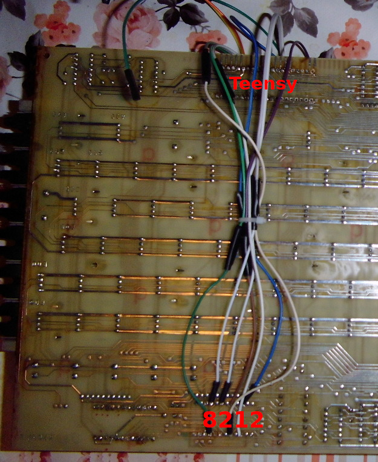

# VEB Robotron K7637 Replacement Controller and Firmware

This repository hosts a replacement controller and firmware for the
[VEB Robotron K7637](https://www.robotrontechnik.de/index.htm?/html/zubehoer/tastaturen.htm#k7637)
keyboard based on the [TMK Keyboard Firmware](https://github.com/tmk/tmk_keyboard)
framework.
It allows you to attach the venerable keyboard to a modern PC using USB
while supporting most of its original features and many new features:

* Full N Key Rollover.
  The original firmware supported only 3-Key Rollover.
* The security key ("Bediensicherungsbaugruppe") is exposed as a key
  between F19 and F24.
* Supports the [Unimap keymapping framework](https://github.com/tmk/tmk_keyboard/blob/master/tmk_core/doc/unimap.txt)
  which eases adapting the keyboard layout and allows you to edit the keymap without
  recompilation using the online [Keymap editor](http://www.tmk-kbd.com/tmk_keyboard/editor/unimap/).
* All of the seven LEDs are supported in one way or another:
  * The Caps Lock LED does what you expect.
  * Three of the five LEDs in the first row (G00-G04) display the standard
    [Num Lock, Scroll Lock and Compose LED states](#LEDs).
  * One of the LEDs displays the keyclick mode.
  * The last LED in the first row (G53) displays the USB Kana LED state
    but will also trigger the built-in buzzer.
  * The five LEDs in the first row (G00-G04) are all dimmable via PWM.
    This can be used for cool animations.
* The built-in buzzer is supported and its frequency can even be modulated.
  It can be used as an error indication by enabling the USB Kana LED and
  can even be [configured as your system beep](#Buzzer-As-System-Beep).
* There are currently two demo songs to show off the buzzer and LEDs.
  Try pressing LSHIFT+ET1+ET2+F1 and LSHIFT+ET1+ET2+F2.
* Several keyclick modes are supported.
  Press LSHIFT+ET1+ET2+Space to toggle them.
  * Trigger a solenoid via a relay (or trigger only the relay).
    The original hardware did not feature any solenoid.
  * Emit a short beep on every keypress.

## Building the Replacement Controller

**This section is under construction.**

You will need to acquire the following items:

* [Teensy 2.0++](https://www.pjrc.com/store/teensypp.html).
  The firmware has only been tested with this controller and we rely on its
  particular shape.
* Pin Headers
* Lots of jumper cables
* If you want to attach the solenoid:
  * Some Arduino-compatible relay breakout board
  * A "flyback" diode
  * _The solenoid is currently under evaluation._
* (De)soldering equipment.

First, you should desolder the UB 880 D processor and the 8212 IO chips.
If you don't plan on reusing these components, you can cut off all pins using
wire cutters.
Then heat up the pins on the backside of the PCB and when the solder melts
push them to the foreside.
Using pliers, you should be able to pull them off.
At least for the UB 880 D, all pin holes should be free of solder.

Secondly, you should "neutralize" the following chips - it is sufficient
to cut their power pins:

* The EEPROM.
* __FIXME__

Now, solder pin headers at least to the following pins on the backside of the
Teensy 2.0++:
__FIXME__

You should also solder pin headers to the following pins of the Teensy's top:
__FIXME__

Solder breadboard wires to the following pins of the Teensy:
GND (near the USB connector), VCC, E4, E5

Now, solder the wire from GND into pin 29 of the former UB 880 D,
the wire from VCC should be soldered to pin 11, the cable from E4 should go
into pin 10 (D6) and E5 should connect to pin 9 (D5):

You can now push the Teensy into the former UB 880 D's place.
I recommend not to solder it immediately since you might want to test the firmware
first.
Most pins should already make contact without soldering.
It might be advisable to use an appropriate socket, so the Teensy can be
removed as often as you wish.
However, I have not tested this and you must take into consideration that it
increases the height of the construction.
Since the metal frame is going to rest above the Teensy, there might not be
enough space to house all of the jumper cables (unless of course, you
omit the pin headers on the Teensy's top and solder wires directly).

Finally, you should connect the former UB 880 D's pin 20 (IORQ) to GND.
I did this during testing by soldering a pin header to one of the nearby
pads and using a jumper cable.
Later I made connection to the Teensy's GND pin using some additional solder
but you could also find some other GND on the board and solder a cable to it.

Now, solder wires *on the backside* of the PCBs to the following pins of the former
8212 IO chip: 4, 6, 8, 10, 15, 17, 21

These wires connect to the Teensy in the following order: __FIXME__

Desolder the buzzer's 390R resistor and connect the side *facing away* from it
to a jumper cable.
It will connect to pin __FIXME__ of the Teensy.

Connect the VCC, GND and the control pin of the relay using jumper cables with
the Teensy.
The control pin should be connected to PB3 of the Teensy.

__FIXME__: How to connect the solenoid.

You should now be ready to test your installation.
If everything goes well and you can determine that possibly dead keys are only
related to missing solder, you can fixate/solder your Teensy to the PCB.

The endresult should look similar to this:

 

## Building and Flashing the Firmware

First install some packages:

    sudo apt-get install build-essential gcc-avr avr-libc

Furthermore, you will need to build and install the
[`teensy_loader_cli` flash tool](https://github.com/PaulStoffregen/teensy_loader_cli).

Building the firmware should now be straight forward:

    git submodule update --init --recursive
    make

In order to flash the firmware, invoke `make teensy` and press
the Reset button on the Teensy 2.0++.
Once a firmware is running, you can also activate the Teensy Halfkay
bootloader by pressing LSHIFT+LCTRL+RALT+Pause (LSHIFT+ET1+ET2+PF11 on the K7637.50 layout).

See also: https://github.com/tmk/tmk_keyboard/blob/master/tmk_core/doc/build.md

## Keymap

Since the firmware supports the Unimap keymapping framework, you can tweak the
layout without recompilation by uploading the firmware on
[Keymap Editor website](http://www.tmk-kbd.com/tmk_keyboard/editor/unimap/).

The actual K7637 key arrangement differs significantly from the standard PC layout
assumed by Unimap.
It has been tried to choose PC equivalents of the K7637 keys by geometry.
If in doubt, have a look at [unimap_trans.h](unimap_trans.h) on how exactly the
keys are mapped.

## LEDs

The standard USB lock lights are located as follows:

| capslock   | LED next to the Caps Lock key (C99) |
| numlock    | 1st LED on the top row (G00) |
| scrolllock | 5th LED on the top row (G04) |
| compose    | 3rd LED on the top row (G02) |
| kana       | 6th LED on the top row (G53) - *this also triggers the buzzer* |

On Linux, you can manually set these LEDs using the following command:

    echo 1 | sudo tee /sys/class/leds/inputX\:\:Y/brightness

Wheres *X* is a number and the *Y* is the name of the LED (eg. `input28::scrolllock`).
Writing a 0 disables the corresponding LED.

## Buzzer As System Beep

It is assumed that the "kana" LED is not really used as a regular keyboard LED.
On Linux, you can trigger the buzzer along with the fifth LED using the following command:

    echo 1 | sudo tee /sys/class/leds/inputX\:\:kana/brightness

Whereas *X* is a number.
You can check which device it belongs to by consulting
`/sys/class/leds/inputX\:\:capslock/device/name`.

There is also a script `k7637-beep.sh` for automatically finding the correct
LED node and triggering it for a short while.
This script might need root privileges (but see below).
You should install it into `/usr/local/bin`:

    sudo cp k7637-beep.sh /usr/local/bin/k7637-beep

You should allow all users to set the keyboard's LEDs by installing some Udev rules:

    sudo cp k7637.rules /etc/udev/rules.d/50-k7637.rules

**FIXME:** Maybe we should add a `make install` rule to install these files...

You will have to reload the Udev rules using `sudo udevadm control --reload` in order to
try out this change immediately.
`k7636-beep` will now also run from non-root users (ie. without sudo).
If you deem the Udev rule above too liberal, you could of course also adapt it easily to grant
access only to a "led" group for instance and add your user to that group.

`k7637-beep` is especially useful as a system bell.
You could use "xkbevd" (x11-xkb-utils package on Ubuntu) to automatically execute `k7637-beep`
whenever the X11 bell event is received.
To do so, create `~/.xkb/xkbevd.cf` with the following contents:

    Bell() shell "k7637-beep $d"

Now you can automatically start xkbevd on login by creating the file `~/.config/autostart/xkbevd.desktop`
with the following contents:

    [Desktop Entry]
    Comment=XKB event daemon
    Exec=xkbevd -bg
    Terminal=false
    Type=Application

Or you could use one of the dozen other ways to start xkbevd on login...
Note that it is important to have installed the Udev rule mentioned above since xkbevd will run
as the current user (although you might try setting its setuid flag if the Udev rule will not work
as expected).

As an alternative to xkbevd, you might want to try [xbelld](https://gitlab.com/gi1242/xbelld).

## TODO

* It would be nice if we could control all LEDs and the buzzer including brightness/frequencies
  from userspace (ie. from your PC).
  Unfortunately, this does not seem to be supported by a standard USB HID keyboard.
  There are at most 5 LEDs and they can only be on or off.
  The only feature we're not yet using would be the keyboard backlight (see `BACKLIGHT_ENABLE`),
  but it will work only for one LED or the buzzer.
  For more, we'd have to create an USB composite device in order to provide a CDC device accepting
  more complex commands.
  Perhaps this will help: https://github.com/tmk/tmk_keyboard/issues/662
  * Perhaps we could also use a custom "HID report" descriptor?
    See https://forums.obdev.at/viewtopic.php?t=9434
* Now that we directly control the buzzer, it would also be possible to play custom waveforms.
  This should be rather easy using an additional IRQ.
  It could be used for additional keyclick modes.
  First tests have not been promising as the result is too noisy.
  But I tried to bit-bang a 2-bit wave at 44kHz. Perhaps it's better to PWM between
  samples.
* Support more of the keyboard variants (different layouts).
  Unfortunately, I own only the K7637-00 (or is it K7637-50?).
  You should add a file `unimap_XX.c` for every variant and adapt `UNIMAP_K7637()`.
  There can be more or less keys and a default mapping may make sense, etc.
  Otherwise, the firmware should work unmodified on all models.
* PF0-7 are ADC pins. Perhaps we can use this to read out some of the keys analogue?
  That would give us a keypress "strength".
* The Right Shift key is physically connected to the Left Shift key.
  That's why there is only one keycode and there is no Right Shift entry in the keymap.
  This could be remedied by a very simple hardware hack:
  Cut either the row or the column trace and bridge it to some other unused position
  in the keyboard matrix.
  This would require merely an entry in unimap_trans and UNIMAP_K7637().
  Keyboards without this modification will also continue to work.

## See Also

The ["keyboard babel"](http://kbdbabel.org/) project contains a K7637 to PS/2 converter
(ie. should work with an unmodified board).
Unfortunately, the schematics and source code are nowhere to be found.
It shouldn't be hard to build a modern USB converter, though as the keyboard's
serial protocol is [well documented](docs/SerielleTastatur_K7637_XX_Betriebsdokumentation.pdf).
You merely need to add a current loop transceiver.
My particular board was simply broken, so I gave up on this approach.
The kbdbabel website was nevertheless invaluable for its [K7637 schematics](docs/kbdbabel_doc_robotron_k7637-50.pdf).
It also contains an [EEPROM dump](http://kbdbabel.org/rom/robotron-k7637_50-2716.bin) that could be of use
in restoring a K7637 board.
You might also be interested in the [IFFS connector pinout](http://kbdbabel.org/conn/kbd_connector_k7637.png).
